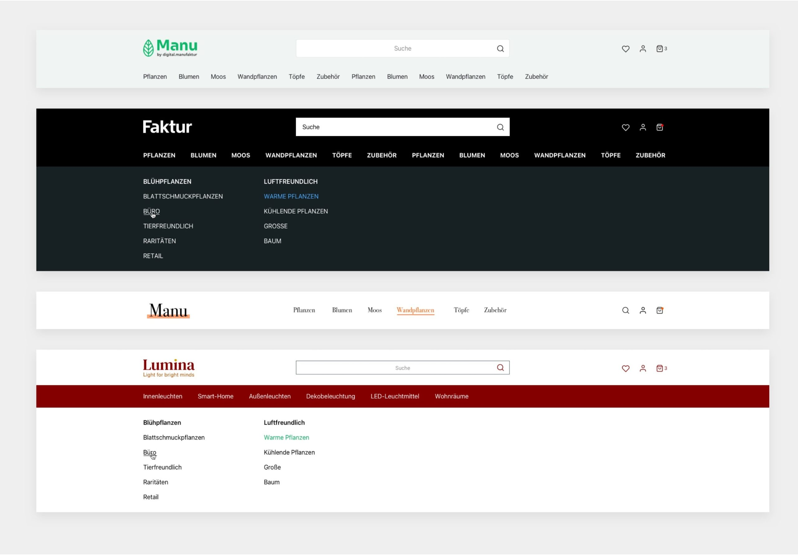
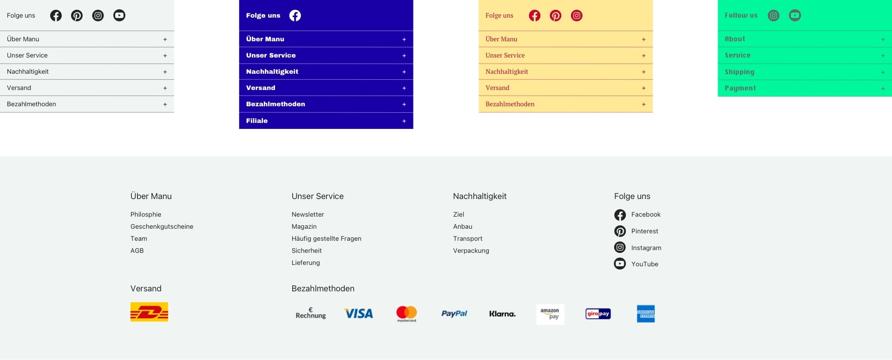
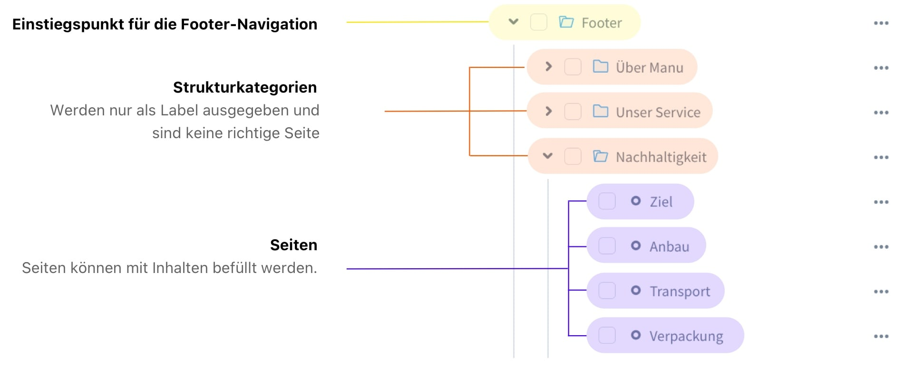
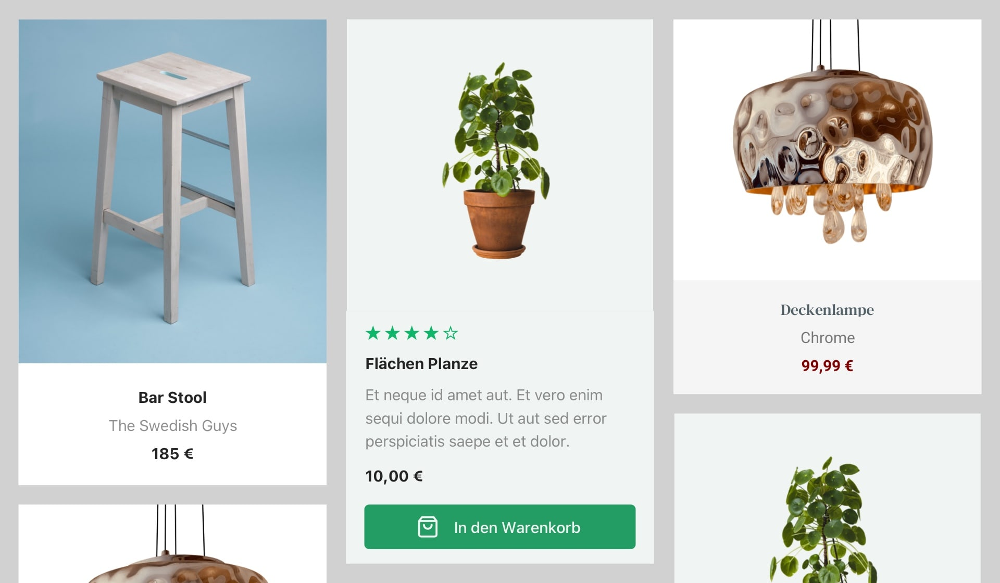
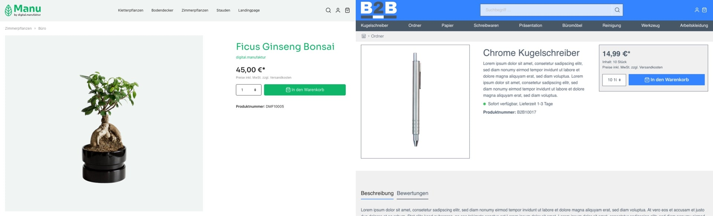
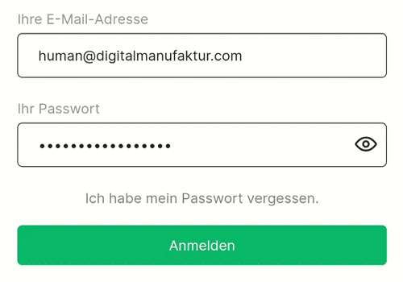
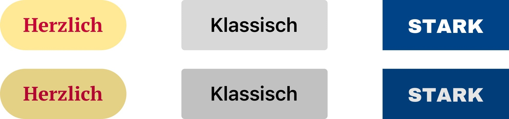
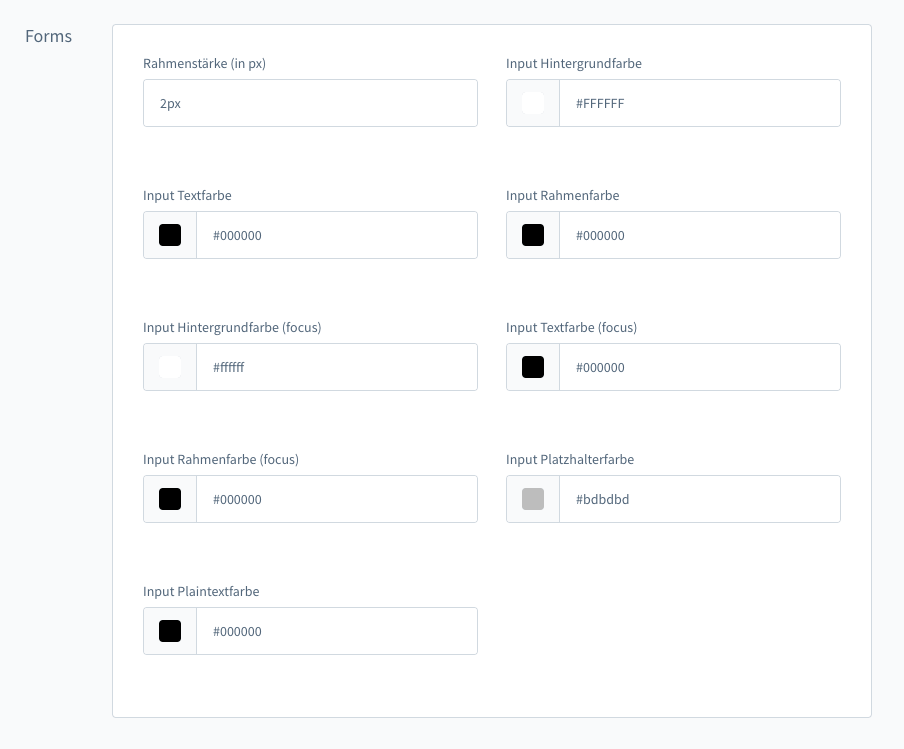

# Shopware 6 Manu Theme
**Manu ist ein kostenfreies, flexibles und performantes Shopware 6 Theme**

| :inbox_tray: | [Kostenfrei herunterladen](https://www.digitalmanufaktur.com/shopware-6-theme-manu/?utm_source=github&utm_medium=link&utm_campaign=manu_theme) |
| - | --- |

## Systemvorraussetzungen
* Shopware 6.*

## Inhaltsverzeichnis
**[Installation von Manu](#installtion-von-manu)**  
[Manu Theme einem Verkaufskanal zuweisen](#manu-theme-einem-verkaufskanal-zuweisen)  

**[Theme Einstellungen](#theme-einstellungen)**  
[Header und Navigation](#header-und-navigation)  
[Footer und Social Media](#footer-und-social-media)  
[Social Media anlegen](#social-media-anlegen)  
[Anlegen eines Footers im Theme](#anlegen-eines-footers-im-theme)  
[Breadcrumb](#breadcrumb)  
[Newsletter](#newsletter)  
[Kategorie](#kategorie)  
[Produkt-Seite](#produkt-seite)  
[Checkout](#checkout)  
[Account](#account)  
[Buttons und Formulare](#buttons-und-formulare)  
[Textbausteine](#textbausteine)  

## Installation von Manu
1. Die aktuelle Version von Manu herunterladen
2. Im Admin-Bereich vom Shop Backend anmelden
3. Einstellungen aufrufen und dort den Reiter "System" auswählen
4. Den Punkt "Plugins" aufrufen
5. Oben auf Plugin hochladen klicken
6. Die heruntergeladene ZIP-Datei des Manu Themes auswählen

Anschließend kann es einen kurzen Moment dauern, bis das Theme auf den Server geladen wurde. Abgeschlossen ist dies, wenn das Theme in der Liste der Plugins erscheint:

7. Auf die 3 Punkte rechts klicken und "Installieren" auswählen
8. Das Theme kann nun in der Spalte Status aktiviert werden

Die Aktivierung kann wieder einen Moment dauern. Anschließend wird das Plugin als aktiviert angezeigt.

## Manu Theme einem Verkaufskanal zuweisen
1. Verkaufskanal auswählen, dem das Theme zugewiesen werden soll
2. Im Reiter Theme auf den Button "Theme ändern" klicken
3. Das Manu Theme auswählen und mit Klick auf "Theme übernehmen" den Vorgang bestätigen

Die Aktivierung kann einen Moment dauern und ist abgeschlossen, wenn das Theme ausgewählt ist. Nun kann der Verkaufskanal aktualisiert werden und das Manu Theme ist sichtbar.

***

## Theme Einstellungen
Unter Inhalte → Themes können Einstellungen an dem Manu Theme vorgenommen werden.

### Allgemein
In dem Manu Theme gibt es über 150 Einstellungsmöglichkeiten, die dabei helfen, Ihrem Shop einen Kickstart zu verpassen. An vielen Orten verleihen Variationen der Farben, Formen und Verhalten Ihrem Shop einen indivuellen Charaktar.

### Header und Navigation
Der Header ist einer der sichtbarsten Bereiche, da dieser bei jedem Laden einer Seite angezeigt wird. Hier finden Sie im Theme viele Einstellungsmöglichkeiten, die dem Shop Individualität verleihen. Der Header kann je nach Anforderung in 2 Varianten dargestellt werden. 

Wie im Screenshot zu sehen, können Header und Navigation seperat mit Einstellungen angepasst werden. Neben der Desktop Darstellung wird natürlich auch Mobile berücksichtigt.

### Footer und Social Media
Der Footer hat ähnlich wie der Kopfbereich umfangreiche Einstellungsmöglichkeiten wie Anzahl der Spalten, der Hintergrundfarbe oder Textfarbe. Zudem kann neben der Footer Navigation ein Social Media Bereich aktiviert werden. Dieser Bereich passt sich automatisch, je nach getroffenen Theme-Einstellungen, optimal an.

### Social Media anlegen
1. Aktivieren Sie in den Theme-Einstellungen die Social Media Kanäle, die Sie benötiogen
2. Unter Einstellungen > Textbausteine wählen Sie die Sprache aus
3. Schreiben Sie oben in die Suche **footer.social**
4. Sie erhalten eine Liste mit allen anpassbaren Textbausteinen für dieses Modul
5. Fügen Sie die jeweilige (vollständige) URL ein, unter der das Profil erreichbar ist

### Anlegen eines Footers im Theme
1. Wählen Sie in den Theme-Einstellungen die Anzahl der Spalten aus
2. Legen Sie in der Kategorieverwaltung eine Kategorie als Einstiegspunkt für den Footer an, z.B. Footer
3. Innerhalb des Einstiegspunktes können Sie nun pro Spalte eine einzelne Kategorie mit dem Kategorietyp "Strukturkategorie" anlegen (Über uns, Service …)
5. Innerhalb dieser Spalten können Sie nun die einzelnen Seiten anlegen, die angezeigt werden sollen (in Form von Unterkategorien)
6. Anschließend kann im Verkaufskanal in den Grundeinstellungen ein *Einstiegspunkt für die Footer-Navigation* gewählt werden. Wählen Sie dort Footer aus.

### Breadcrumb
Die Brotkrümelnavigation wurde im Theme umfassend erweitert, neben den klassischen Farbanpassungen kann ein Home-Icon oder Home-Label hinzugefügt werden, welches den Kunden auf die Startseite bringt. Außerdem ist es möglich, wenn es viele Unterseiten oder Seiten mit langen Namen gibt, jeweils nur die Eltern Kategorie anzuzeigen. Dadurch wirkt es optisch aufgeräumter und klarer für die Kunden.

### Newsletter
Über dem Footer kann ein konfigurierbares Newsletter-Modul eingerichtet werden. Es kann entweder nur die E-Mail Adresse, oder auch ein umfangreicheres Formular in den Theme-Einstellungen aktiviert werden. Die Newsletter-Daten werden im Shopware 6 Standard Bereich unter Marketing → Newsletter Empfänger gespeichert.

### Kategorie
Ein besonderes Augenmerk liegt hier auf den Produktboxen. Es können separate Farben für dieses sehr wichtige Element vergeben werden, sodass der individuelle Marken-Charakter sichtbar wird. Dazu können unterschiedliche Informationen wie die Lieferzeit oder Bewertungen ein- oder ausgeblendet werden.

### Produkt-Seite
Die für Conversion wichtige Buybox auf der rechten Seite kann dem Marken-Charakter durch Farben und Informationen angepasst werden. Thumbnails können z. B. unter oder neben dem Hauptbild angezeigt werden.

Zusätzlich gibt es auch für die Produkt-Beschreibung mehrere Darstellungsoptionen. Neben der Standard-Einstellung in Tabs ist es unter anderem möglich, auch Anker-Marken zu verwenden. Dadurch werden alle Inhalte auf einmal dargestellt, was ihrem Shop in Sachen SEO & Findability einen zusätzlichen Boost verleihen kann. All das und noch viel mehr kann über die Theme-Einstellungen von Manu realisiert werden.

### Checkout
Neben der Kategorie und Produkt-Seite ist der Checkout ein wichtiger Bereich, der in Manu optimiert wurde. Neben unterschiedlichen Informationen wurde auch eine Einstellung integriert, die es ermöglicht, immer einen *Zur Kasse Button* in Reichweite zu haben. Gerade Onlineshops mit einem umfangreichen Warenkorb können so auf den nächsten Schritt hinweisen und so die Conversion-Rate erhöhen.

### Account 
Der Login Bereich und insbesondere die Eingabe des Passwortes ist ein sensibles Thema. Das Manu-Theme erweitert auf Wunsch die Eingabe des Passworts. Durch ein Augen-Symbol oder Label kann der Kunde das eingegeben Passwort anzeigen lassen. Dadurch wird die User Experience des Shops optimiert. Der Kunde kann sich so vergewissern, dass die Eingabe korrekt ist. Dadurch wird die doppelte Eingabe obsolet. Der Account-Bereich wurde im Manu-Theme um kurze, anpassbare & erklärende Text erweitert.

### Buttons und Formulare
Buttons haben für Conversion und die Markenwahrnehmung einen wichtigen Stellenwert und werden deshalb im Theme mit eigenen Einstellungen versehen. 

***

Auch Formulare wie Login, Registrierung, Gutscheinfeld können im Theme angepasst werden. Ob eine spezielle Rahmenfarbe oder Textfarbe bei der Eingabe. Die Anpassbarkeit ist auch hier gegeben, um die Marke bestmöglich zu erleben.

### Textbausteine
Alle Labels und Texte, die im Manu-Theme hinzugefügt wurden, können über die Shopware Textbausteine angepasst werden. Lediglich die Sichtbarkeit wird im Theme eingestellt.
